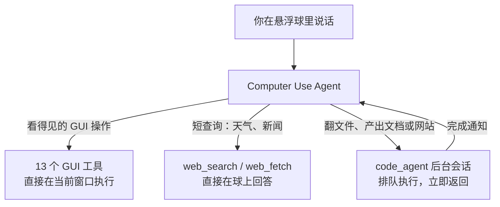

<p align="center"></p>

# DeepSeek Orb

常驻电脑待命的桌面 AI Agent 助手，支持 macOS 和 Windows，基于 [DeepSeek Harness](https://github.com/deepseek-ai/deepseek-harness)（dsh）构建。

屏幕边缘始终停着一颗悬浮球。向它说一句话，看得见的快速操作它直接操纵当前应用当场办完（Computer Use）；耗时的复杂任务它派给后台代码会话去跑，完成后把结果带回球里。主窗口沿用完整的 dsh Web UI，会话管理、插件市场、模型设置一应俱全，你仍然可以在里面写代码、改文件、跑命令。

应用不收集任何遥测数据。

## 双轨 Agent 架构

悬浮球里的 Computer Use Agent 自己判断你说的每段话怎么走，运行时没有单独的任务分类器：



- **前台轨 · Computer Use**：打开 App、点按钮、填表单、改设置这类看得见的操作，用 GUI 工具直接在你眼前执行，每一步都基于当前最前窗口的实时截图。天气、新闻标题这类短查询也留在球上，用 `web_search` / `web_fetch` 直接回答。
- **后台轨 · Code Agent**：翻找文件、产出 Word/PPT/Excel、搭建网站这类复杂任务，通过 `code_agent` 派给一条后台标准会话排队执行。派发立即返回，球马上告诉你后台正在跑，你可以继续聊别的；后台会话结束并且球空闲时，完成摘要自动回到球里，由 Computer Use Agent 决定下一段——继续点击、再派一段后台工作，还是直接收尾。

后台会话与你在主窗口手动新建的会话是同一种东西，出现在主窗口侧栏的 `dsh_orb` 文件夹下，可以打开、接着聊、停止；只有发起它的那条球对话能续写或停止它。同一份产物的后续修改发回同一条后台会话，无关的新工作另开一条。悬浮球上的停止按钮只取消球的 Computer Use 会话，不影响后台会话。

## 悬浮球

应用启动后，球停在主显示器右沿、垂直方向中间稍下的位置，始终置顶。默认模型是 DeepSeek-V41-Flash、思考强度 Max。

- **悬停**展开面板，**单击**固定面板，指针离开后自动折叠。
- **拖动**移动球；大约五分之一拖出左右屏幕边缘后松手，球停靠成一根灰色细条，再次悬停即滑回。
- **右键**打开菜单：打开主窗口、悬浮球 Agent 设置与后台 Agent 设置（两条轨各自独立选择模型和思考强度）、划词工具条开关、千分比坐标开关、退出 DeepSeek Orb。
- 面板内有与主窗口一致的对话记录、绕球折行生长的输入框（回车发送，Shift+Enter 换行）、**Access** 权限芯片（仅可查看 / 工作区内修改 / 完全权限，默认完全权限，对球上的命令和它派出的后台会话生效）、**历史**（列出球上的 Computer Use 对话）和**新建**。Agent 向你提问时，问题卡片直接在球上作答。
- 在任意应用里拖拽划选文字会弹出工具条：**搜索**（用默认浏览器打开 Bing）、**翻译**（结果写入球当前对话）、**发给 Agent**（原文贴在输入框旁，回车连同你的指令一起发出）。
- 球头像可在主窗口设置 → 悬浮球里换成自定义 GIF / PNG / WebP（2 MB 上限）。

关闭主窗口不会退出应用；只有右键菜单里的「退出 DeepSeek Orb」会结束进程。

## Computer Use

球上的对话全部走 Computer Use：第一条消息发出时自动附上当前最前应用的可见窗口截图，每次操作后再截一张，模型始终看得到屏幕的最新状态。截图会自动省略球、展开面板、划词工具条和观察边框，操作期间 overlay 也不会挡住点击。被观察的窗口四周会亮起一圈观察边框，标示 Agent 正在看哪里。坐标默认用 0–1000 千分比编码，可在右键菜单切换成像素模式。

工具清单：`click`（单击/双击/右键/按住修饰键）、`input_text`、`scroll`、`hotkey`、`long_press`、`drag`、`wait`、`long_wait`、`screenshot`（保存到桌面并复制进剪贴板）、`open_in_browser`、`open_in_finder`、`list_apps`、`open_app`。

- **macOS**：首次展开面板时需要授予「屏幕录制」与「辅助功能」权限，引导层会打开系统设置对应页面，两项都授予后自动消失；访达自动化在首次使用时弹出授权。
- **Windows**：无需系统权限引导；以管理员身份运行的窗口会拒绝被点击和输入。
- 运行前请阅读 [SAFETY.md](SAFETY.md) 的安全须知。

## 平台支持

| 平台 | 悬浮球与 Computer Use | 安装包 |
|---|---|---|
| macOS（Apple Silicon / Intel） | 完整支持；需屏幕录制 + 辅助功能权限 | 签名 DMG / ZIP；本地未签名预览包 |
| Windows x64 | 完整支持；管理员窗口拒绝被操作 | NSIS 安装包（.exe）；本地未签名包 |
| Linux | 不创建悬浮球；主窗口可用，设置页控件禁用 | 非发布目标 |

## 启动

### 准备

- Node.js `^22.19.0 || >=24.0.0`，pnpm `11.7.0`。
- [DeepSeek API 密钥](https://platform.deepseek.com/)：启动后在主窗口**设置 → 模型**里保存，或启动前 `export DEEPSEEK_API_KEY=…`。密钥存放在 `~/.dsh/.credentials.yaml`，与 dsh CLI 共享。
- 主窗口选中工作区后输入框才可用；悬浮球自动使用自己的 `dsh_orb` 工作区，无需配置。

### 从源码运行

```sh
git clone https://github.com/mini-yifan/deepseek-orb.git
cd deepseek-orb
pnpm install
pnpm run dev:desktop
```

`dev:desktop` 构建 Host、客户端、Web 前端和 Electron 壳，并启动未打包的应用；已经构建过时用 `pnpm run start:desktop` 跳过构建。主窗口先显示「正在启动 DeepSeek Orb…」，就绪后载入 Web UI，屏幕边缘出现悬浮球。

### 本地打包

| 目标 | 命令 | 说明 |
|---|---|---|
| macOS（Apple Silicon） | `pnpm run package:desktop:mac:arm64` | 签名发布流程见 [MAC-RELEASE-PACK.md](apps/desktop/MAC-RELEASE-PACK.md)，未签名预览包见 [UNSIGNED-MAC-PACK.md](apps/desktop/UNSIGNED-MAC-PACK.md) |
| Windows x64（未签名） | `pnpm run package:desktop:win:x64:unsigned` | 环境变量与工具缓存见 [UNSIGNED-WIN-PACK.md](apps/desktop/UNSIGNED-WIN-PACK.md)；SmartScreen 会拦截，选择仍要运行 |

打包细节与平台要求见 [apps/desktop/README.zh.md](apps/desktop/README.zh.md)。

## 与 DeepSeek Harness 的关系

本仓库 fork 自 [deepseek-ai/deepseek-harness](https://github.com/deepseek-ai/deepseek-harness)，`main` 分支承载 DeepSeek Orb 产品。dsh 是 DeepSeek AI 开源的「万物皆插件」agent harness，本产品的会话、插件、工具与 Web UI 都由它驱动。继续深入：

- [使用桌面端](docs/user/guide/desktop.zh.md) — 悬浮球与后台派发的完整用户指南
- [Computer Use 包](packages/experimental/tool-computer-use/README.zh.md) — GUI 工具、坐标编码与权限细节
- [apps/desktop/README.zh.md](apps/desktop/README.zh.md) — 开发变量、打包与更新
- [docs/architecture.md](docs/architecture.md)、[packages/README.md](packages/README.md) — 底层 harness 的架构与包地图

## 已知限制

- 不支持语音输入、屏幕圈选截图和逐次点击审批。
- 只有悬浮球系统排除在 Computer Use 截图之外；主窗口始终可被截图、可被点击。
- Computer Use 是 experimental 包，以内置 runtime extra 形式随应用分发，不是 Desktop Host 的 npm 依赖。
- Linux 上无悬浮球；Windows 本地未签名安装包会被 SmartScreen 拦截，需手动放行。

## 许可

[MIT](LICENSE)，继承自上游 DeepSeek Harness；第三方依赖许可见 [THIRD_PARTY_NOTICES.md](THIRD_PARTY_NOTICES.md)。
